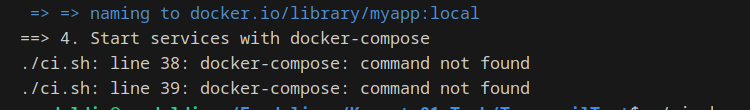
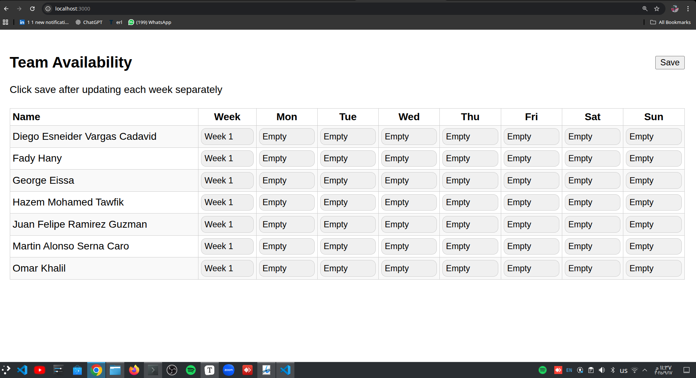

# Project Setup & Pipeline Documentation By Emad Eldin Adel 

This project demonstrates how to containerize a **Node.js + PostgreSQL** application with Docker and Docker Compose, and how to run a local CI pipeline with Bash.

The documentation below covers **all important files, their purpose, and best practices And All The Required Images At The End OF Document**.


##  How to Run the App Locally  

### 1. Prerequisites  
- Install [Docker](https://docs.docker.com/get-docker/) and [Docker Compose](https://docs.docker.com/compose/).  
- Install [Node.js](https://nodejs.org/) (for local development).  

### 2. Clone the Repository  
```bash
git clone https://github.com/ge0rgeK/TeamavailTest.git
cd TeamavailTest
```

### 3. Run the App Using Docker Compose

```bash
./ci.sh   # Runs linting, tests, builds image, starts services
```

This will:

- Run code formatting & linting.
- Run tests 
- Build the app image.
- Start the app and database with Docker Compose.

### 4. Stopping the App

```bash
./stop.sh   # Stops and cleans up containers, volumes, and networks
```


### 5. Access the App

- Open: http://localhost:3000
- Health check endpoint: http://localhost:3000/health

---

##  How the Pipeline Works

The pipeline is defined in **`ci.sh`**:

1. **Formatting & Linting**
   - Uses Prettier and ESLint  .
   - Ensures clean and consistent code.
2. **Run Tests**
   - Runs `npm test`  defined in `package.json`.
3. **Build Docker Image**
   - Builds an optimized image tagged as `myapp:local`.
4. **Start Services**
   - Runs `docker compose up -d` to start:
     - The Node.js app.
     - PostgreSQL database.
   - Cleans old containers/volumes first.
5. **Health Check**
   - Waits for the app to respond at `/health`.
   - Fails if not healthy within 2 minutes.

----

## What Each Part Does

### 1. **server.js**

- Express.js app.
- Serves frontend (from `/public`).
- Serves JSON input files (from `/input`).
- Writes history data into `/output/history.json`.
- Provides `/health` endpoint for monitoring.

### 2. **Dockerfile**

- Builds a minimal Node.js app image.
- Uses production best practices (small base image, only necessary files).

### 3. **docker-compose.yml**

- Defines two services:
  - `app`: Runs Node.js server.
  - `db`: PostgreSQL database.
- Uses **volumes** to persist database data.
- Maps ports (default: `3000:3000`).

### 4. **ci.sh**

- Automates: linting, testing, image building, service startup, and health checks.

### 5. **stop.sh**

- Cleans everything: stops containers, removes volumes and networks.

------

## Common Problems & Solutions

- **Database not persisting data**

  - Fixed by using Docker volumes in `docker-compose.yml`.

- **App container restarting or failing**

  - Check logs using:

    ```bash
    docker compose logs app
    ```

- **Health check failing**

  - Ensure that `/health` endpoint is implemented in `server.js`.
  - Increase wait time in `ci.sh` if app needs more startup time.

**`docker-compose` command not found**

- Some systems only support `docker compose` (newer Docker versions).

- Solution: our script (`ci.sh`) auto-detects which one to use.

```bash
# Detect whether to use docker-compose (standalone) or docker compose (plugin)
if command -v docker-compose >/dev/null 2>&1; then
  DOCKER_COMPOSE="docker-compose"
elif docker compose version >/dev/null 2>&1; then
  DOCKER_COMPOSE="docker compose"
else
  echo "❌ Neither docker-compose nor docker compose found. Please install Docker Compose."
  exit 1
fi
```

Then, everywhere in the script where you currently call `docker-compose`, replace it with:

```bash
$DOCKER_COMPOSE
```
----

